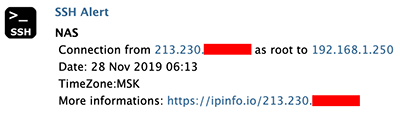
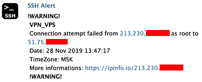

## Alert via telegram when user logon via SSH

Work on all popular linux system (Debian, Ubuntu, Arch Linux etc..)

This fork connects to the Telegram API through the HTTP proxy,
which allows the script to work in countries where telegram is blocked.



A notification about an unsuccessful login attempt has been added, which is important for tracking brute force attack attempts.



### Requirement
- curl
- git (much easy to install)
- http proxy

### Install
1) Clone or download to /opt/ folder
```cd /opt/ && git clone https://github.com/gungstarbeiter/ssh-login-alert-telegram```
   If telegram isn't blocked in your country run:
```cd /opt/ssh-login-alert-telegram && git checkout noproxy```

2) Edit configuration variables by editing credentials.config:
```nano /opt/ssh-login-alert-telegram/credentials.config```

3) Add this script when user connect with the deploy script:
```bash /opt/ssh-login-alert-telegram/deploy.sh```

4) Confirm that the script is working by logging you to ssh again.


### Install with Ansible

If you have many servers go check: https://github.com/MyTheValentinus/Deploy-Telegram-SSH-Alerting-with-Ansible (fork of initial @stylernico work)
